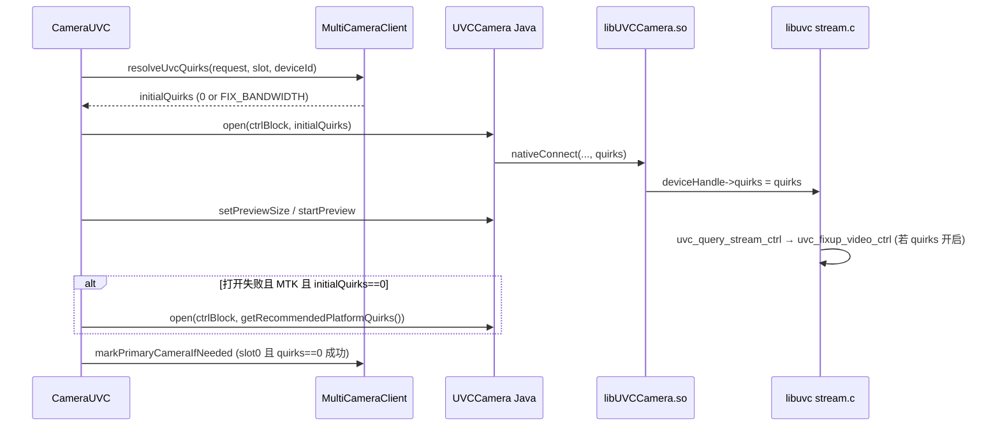

# MTK 芯片相关修改分析

> 文档说明：本文档基于当前 **AndroidUSBCamera-fork** 工程代码整理，说明针对 **联发科（MTK）平台** USB 主机栈及 **HP/SP 双 UVC 摄像头** 场景所做的修改、各自作用与协作关系。  
> 参考来源：`AndroidUSBCamera-3.3.3/有效修改.md`、[UVCAndroid PR #145](https://github.com/shiyinghan/UVCAndroid/pull/145)。

---

## 一、问题背景

| 现象 | 典型场景 | 说明 |
|------|----------|------|
| 第二路 UVC 预览黑屏 | MTK 手机 + HP + SP 双摄像头 | 流能 `open`，但无画面或极不稳定 |
| 单独开 SP 黑屏 | 仅连接 SP 摄像头 | `dwMaxPayloadTransferSize` 协商错误 |
| 全局修带宽后 HP 异常 | 所有摄像头一律开 quirks | 修 SP 可能破坏 HP 等「第一路正常」的设备 |
| 配置阶段 NPE / 崩溃 | AGP 升级后首次同步 | CMake/NDK 未配置、JNI 与旧 `.so` 不一致 |

**共性根因（MTK）**：MediaTek USB 主机栈在 UVC **流协商（Probe/Commit）** 时，对 `dwMaxPayloadTransferSize`（等时带宽 / bulk 载荷）处理与标准 libuvc 假设不一致；多路摄像头并发时第二路更容易暴露。表现为 **设备已连接、预览管线已走通，但无有效视频帧**。

---

## 二、设计原则（本 fork 核心思路）

1. **默认不破坏原行为**：`quirks = 0` 为默认，仅在对的路况下启用 `UVC_QUIRK_FIX_BANDWIDTH`。
2. **按平台 + 按路序 + 按设备角色** 自动决策，而非写死全局开启。
3. **Native 层真正改带宽**，Java 层只负责 **何时传入 quirks**。
4. **构建链保证** 新 JNI（`nativeConnect` 8 参数）与 ndk-build 产物一致，避免旧 `libUVCCamera.so` 导致崩溃。

---

## 三、修改总览

| 层级 | 文件/模块 | 修改要点 | 主要作用 |
|------|-----------|----------|----------|
| Native 协议 | `libuvc/.../libuvc_internal.h` | `UVC_QUIRK_FIX_BANDWIDTH`、`quirks` 字段、Android URB 数量 | 为带宽修正提供开关与设备句柄状态 |
| Native 协议 | `libuvc/.../stream.c` | `uvc_fixup_video_ctrl()` | 在 Commit 前修正 payload/带宽（仅 quirks 开启时） |
| JNI | `UVCCamera.h/cpp`、`serenegiant_usb_UVCCamera.cpp` | `connect(..., quirks)`、`nativeConnect(..., I)` | Java quirks 传入 native `deviceHandle->quirks` |
| Java API | `UVCCamera.java` | `open(ctrl, quirks)`、`getRecommendedPlatformQuirks()` | 对外 API + MTK 平台识别 |
| 策略 | `CameraRequest.kt` | `uvcQuirks`、`setUvcQuirks()` | 业务侧手动覆盖自动策略 |
| 策略 | `MultiCameraClient.kt` | slot、主摄标记、`resolveUvcQuirks()` | 多路/切换时自动选 quirks |
| 策略 | `CameraUVC.kt` | `tryOpenAndPreview` + 失败重试 | 单 SP 失败时用 MTK quirks 再开一次 |
| 策略 | `CameraUvcStrategy.kt` | `open(ctrl, quirks)` | 非 Fragment 路径同样带 quirks |
| 生命周期 | `CameraActivity/Fragment.kt` | `clearPrimaryCameraDevice()` | 拔设备后清除主摄记录 |
| 构建 | `libuvc/build.gradle` | `ndkBuild` 依赖、`jniLibs`→`libs` | 保证打包的是新 native 库 |
| 构建 | `libuvc/.../Application.mk` | 仅 `arm64-v8a`/`armeabi-v7a` | 避免 x86 在 Apple Silicon 上 ndk-build 失败 |
| 构建 | 根 `build.gradle` 等 | AGP 7.4.2、NDK 26 | 满足新 Studio，与 NDK 26 配套 |

---

## 四、Native 层修改详解

### 4.1 `UVC_QUIRK_FIX_BANDWIDTH`（`libuvc_internal.h`）

```c
#define UVC_QUIRK_FIX_BANDWIDTH  0x00000080
```

- 在 `uvc_device_handle` 增加 `uint32_t quirks`。
- 仅当 `devh->quirks & UVC_QUIRK_FIX_BANDWIDTH` 时，才执行下文带宽相关修正；**未设置 quirks 的摄像头行为与原版一致**。

**作用**：把「MTK 专用修复」从全局开关变成 **按设备句柄** 的可选能力，避免误伤 HP 等正常设备。

---

### 4.2 `uvc_fixup_video_ctrl()`（`stream.c`）

在 `uvc_query_stream_ctrl()` 的 **GET** 路径末尾调用，对流控制块做修正：

| 步骤 | 条件 | 作用 |
|------|------|------|
| Elgato Cam Link 修正 | 特定 VID/PID | 修正错误 probe 响应（通用兼容，非 MTK 专属） |
| `dwMaxVideoFrameSize == 0` | 任意 | 从 frame 描述符补全 |
| payload 高 16 位异常 | `0xffff0000` 模式 | 清除错误符号扩展 |
| **等时 + 非压缩 + quirks 开启** | MTK 多路关键 | 按分辨率/帧率 **重算** `dwMaxPayloadTransferSize` |
| **bulk + quirks 开启（Android）** | MTK usbfs | 将 payload **限制为 16384** |

**对 MTK SP 预览的直接作用**：

- **等时（isochronous）**：重算带宽，解决「协商值过大/过小导致无帧」。
- **bulk**：限制最大传输单元，避免内核/usbfs 报告异常大 payload 导致提交失败。

**为何必须配合 Java 传 quirks**：Native 修正逻辑已写好，但默认 `quirks=0` 时不进入带宽分支；Java 策略决定哪路摄像头传入 `UVC_QUIRK_FIX_BANDWIDTH`。

---

### 4.3 Android 等时 URB 数量（`libuvc_internal.h`）

```c
#if defined(__ANDROID__)
#define LIBUVC_NUM_TRANSFER_BUFS 8   // 非 Android 为 10
#endif
```

**作用**：MTK 等平台上，过多 URB 同时 `libusb_submit_transfer` 可能返回 **ENOMEM**。将 Android 上缓冲数从 10 降为 8，减轻等时流在多摄时的资源压力。

**说明**：属于 **稳定性辅助**，不是 SP 黑屏的主因；主因仍是 payload/带宽协商。

---

### 4.4 JNI 传递 quirks

| 环节 | 修改 | 作用 |
|------|------|------|
| `UVCCamera::connect(..., int quirks)` | C++ 连接时写入 `mDeviceHandle->quirks` | quirks 进入 libuvc 设备句柄 |
| `nativeConnect(J...String;I)I` | JNI 签名增加最后一个 `int` | 与 Java `UVCCamera.open(..., quirks)` 对齐 |

**集成注意**：必须使用 **ndk-build 重新生成的** `libUVCCamera.so`。旧版 `src/main/jniLibs` 中为 7 参数 `nativeConnect`，会导致 `NoSuchMethodError` 崩溃。当前工程已通过 `libuvc/build.gradle` 强制 `preBuild → ndkBuild` 且 `jniLibs` 指向 `src/main/libs`。

---

## 五、Java / libausbc 层修改详解

### 5.1 `UVCCamera.getRecommendedPlatformQuirks()`

```java
if (hw.startsWith("mt") || hw.contains("mediatek")) {
    return UVC_QUIRK_FIX_BANDWIDTH;
}
return 0;
```

**作用**：读取 `Build.HARDWARE`，在 MTK 芯片手机上返回带宽修正 quirk，其它平台返回 0。  
**局限**：仅识别常见 MTK 命名；极少数机型若 hardware 字符串不含 `mt`/`mediatek`，需业务侧 `setUvcQuirks()` 手动指定。

---

### 5.2 `CameraRequest.uvcQuirks` / `setUvcQuirks()`

| 取值 | 含义 |
|------|------|
| `null`（默认） | 走 `MultiCameraClient.resolveUvcQuirks()` 自动策略 |
| `0` | 强制关闭带宽修正 |
| `UVC_QUIRK_FIX_BANDWIDTH` | 强制开启（某路 SP 仍黑屏时的兜底） |

**作用**：自动策略覆盖大多数 MTK 双摄场景；业务可对单路摄像头 **强制** 开/关 quirks，无需改库。

**示例**：

```kotlin
CameraRequest.Builder()
    .setPreviewWidth(640)
    .setPreviewHeight(480)
    .setUvcQuirks(UVCCamera.UVC_QUIRK_FIX_BANDWIDTH)
    .create()
```

---

### 5.3 打开序号 `mUvcOpenSlot`（`MultiCameraClient`）

- `openCamera()` 时：`mUvcOpenSlot = allocateUvcOpenSlot()`（全局递增计数）。
- `CameraUVC.closeCameraInternal()` 时：`releaseUvcOpenSlot()`。

**作用**：区分「第几路正在打开」的 UVC 设备。在 MTK 上约定：

- **slot 0（第一路）**：默认 `quirks = 0`，优先保证 HP 类主摄正常。
- **slot ≥ 1（第二路及以后）**：自动使用 `getRecommendedPlatformQuirks()`，针对 SP 等第二路。

---

### 5.4 主摄像头标记 `sPrimaryCameraDeviceId`

| API | 行为 |
|-----|------|
| `markPrimaryCameraIfNeeded(deviceId, quirks, openSlot)` | 若 **slot==0 且 quirks==0 且打开成功**，记录该 `deviceId` 为主摄（通常为 HP） |
| `clearPrimaryCameraDevice(deviceId)` | USB 拔出时在 `CameraActivity`/`CameraFragment` 的 `onDetachDec` 中清除 |
| `resolveUvcQuirks(..., deviceId)` | 若当前设备 **不是** 已记录的主摄，且在 MTK 上，则启用 platform quirks |

**作用**：解决 **先开 HP 再切 SP** 或 **双路并存** 时，第二路/非主摄设备需要带宽修正，而主摄仍应保持 `quirks=0` 的场景。

**决策流程（简化）**：

```
resolveUvcQuirks(request, openSlot, deviceId):
  1. request.uvcQuirks != null  → 用指定值
  2. openSlot > 0               → MTK platform quirks（第二路及以后）
  3. deviceId != 主摄且为 MTK    → platform quirks（非主摄的 slot0，如单独再开 SP）
  4. 否则                       → 0
```

---

### 5.5 `CameraUVC` 打开与重试（`tryOpenAndPreview`）

1. `initialQuirks = resolveUvcQuirks(request, mUvcOpenSlot, device.deviceId)`
2. `open(mCtrlBlock, initialQuirks)` + 设置预览尺寸 + `startPreview()`
3. 若失败且 `initialQuirks == 0` 且未手动指定 `uvcQuirks` 且为 MTK：  
   **`retry open with platform quirks`**，再用 `UVC_QUIRK_FIX_BANDWIDTH` 重试一次
4. 成功后 `markPrimaryCameraIfNeeded(...)`

**作用**：

- **单独只接 SP、slot 为 0**：第一次 quirks=0 可能失败，自动用 MTK quirks 重试 → 解决「单 SP 无预览」。
- **不破坏 HP**：HP 通常第一次 quirks=0 即成功，不会进入重试，并被标记为主摄。

**附带改进**（稳定性，非 MTK 专属）：

- `destroyUvcCamera()` 先 `stopPreview`、清 frame 回调再 `destroy`
- `setPreviewSize` 失败时 MJPEG → YUYV 回退
- `frameCallBack` 在 `!isPreviewed` 时直接 return，避免关闭后仍收帧

---

### 5.6 `CameraUvcStrategy`

与 `CameraUVC` 一致：`resolveUvcQuirks(request, 0, device.deviceId)` 后 `open(ctrlBlock, quirks)`。  
**作用**：不走 `CameraFragment` 的集成方式时，同样享受 MTK quirks 策略。

---

### 5.7 `USB_SWITCH_SETTLE_MS`（当前状态）

常量已定义（200ms），注释为 MTK USB hub 切换稳定时间。  
**当前 fork**：`closeCamera()` 仍为立即停线程，**尚未**像参考版那样在关闭回调中 `postDelayed(USB_SWITCH_SETTLE_MS)`。  
**潜在作用**：多摄快速切换时给 USB 总线留出复位时间；若仍遇切换黑屏，可后续接入。

---

## 六、构建与 NDK 配套修改（MTK 联调前提）

虽非 MTK 协议逻辑，但 **不完成则 MTK 修复无法生效**：

| 修改 | 作用 |
|------|------|
| AGP 7.4.2 + Gradle 7.6.3 | 满足 Android Studio 最低要求，正常 Sync/编译 |
| `ndkVersion = 26.1.10909125` | Apple Silicon 主机可 ndk-build；与设备侧测试环境一致 |
| `libuvc`：`preBuild`/`mergeJni*` 依赖 `ndkBuild` | 每次构建前编译含 quirks 的 native |
| `jniLibs` → `src/main/libs`，删除旧 `jniLibs` | 避免打包 7 参数旧 `libUVCCamera.so` |
| `Application.mk` 仅 arm 架构 | 实机 MTK 为 arm；减少开发机编译失败 |

---

## 七、典型场景行为矩阵

| 场景 | 平台 | openSlot | 预期 quirks | 结果 |
|------|------|----------|-------------|------|
| 仅 HP，先开 | MTK | 0 | 0 | HP 正常预览，并记为主摄 |
| HP + SP 双开 | MTK | 0 / 1 | 0 / FIX_BANDWIDTH | 两路均可预览 |
| 仅 SP，先开 | MTK | 0 | 先 0，失败后自动 FIX | SP 经重试后预览 |
| 拔 HP 再开 SP | MTK | 0，非主摄 | FIX_BANDWIDTH | SP 走带宽修正 |
| 手动 `setUvcQuirks(0)` | 任意 | 任意 | 0 | 强制关闭修正 |
| 手动 `setUvcQuirks(FIX_BANDWIDTH)` | 任意 | 任意 | FIX | 强制开启修正 |
| 非 MTK 手机 | 非 MTK | 任意 | 0 | 与原版行为一致 |

---

## 八、数据流示意



---

## 九、与其它修改的边界

以下内容 **不属于 MTK UVC 预览修复**，但常在同一 fork 中一并出现：

| 类别 | 说明 |
|------|------|
| 录像 / Glide 缩略图 | `Mp4Muxer`、`captureVideoStop`、相册缩略图逻辑 → 媒体文件问题 |
| `multidex` 依赖 | Demo Application 编译问题 |
| `libnative` | YUV/MP3 编码 native，与 UVC quirks **无直接关系**，但集成 libausbc 时需一并依赖 |

---

## 十、集成与验证建议

1. **依赖模块**：宿主需包含 `libausbc`、`libuvc`、`libnative`（`libnative` 经 `api` 传递）。
2. **构建**：发布前执行 `./gradlew :libuvc:ndkBuild`，确认 `libUVCCamera.so` 含 `(JIIIIILjava/lang/String;I)I`。
3. **MTK 实机**：分别验证「仅 SP」「HP+SP 双开」「拔插切换」。
4. **日志关键字**：`retry open with platform quirks`、`quirks=`、`getSuitableSize`。
5. **仍黑屏**：对 SP 单独 `setUvcQuirks(UVC_QUIRK_FIX_BANDWIDTH)`，或降低预览分辨率（如 640×480）。

---

## 十一、涉及文件清单（便于 Code Review）

```
libuvc/src/main/jni/libuvc/include/libuvc/libuvc_internal.h
libuvc/src/main/jni/libuvc/src/stream.c
libuvc/src/main/jni/UVCCamera/UVCCamera.h
libuvc/src/main/jni/UVCCamera/UVCCamera.cpp
libuvc/src/main/jni/UVCCamera/serenegiant_usb_UVCCamera.cpp
libuvc/src/main/java/com/jiangdg/uvc/UVCCamera.java
libuvc/build.gradle
libuvc/src/main/jni/Application.mk

libausbc/src/main/java/com/jiangdg/ausbc/camera/bean/CameraRequest.kt
libausbc/src/main/java/com/jiangdg/ausbc/MultiCameraClient.kt
libausbc/src/main/java/com/jiangdg/ausbc/camera/CameraUVC.kt
libausbc/src/main/java/com/jiangdg/ausbc/camera/CameraUvcStrategy.kt
libausbc/src/main/java/com/jiangdg/ausbc/base/CameraActivity.kt
libausbc/src/main/java/com/jiangdg/ausbc/base/CameraFragment.kt

build.gradle
gradle/wrapper/gradle-wrapper.properties
settings.gradle
```

---

*文档版本：与当前 fork 代码一致（含 AGP 7.4.2 / NDK 26 / quirks 全链路）。*
